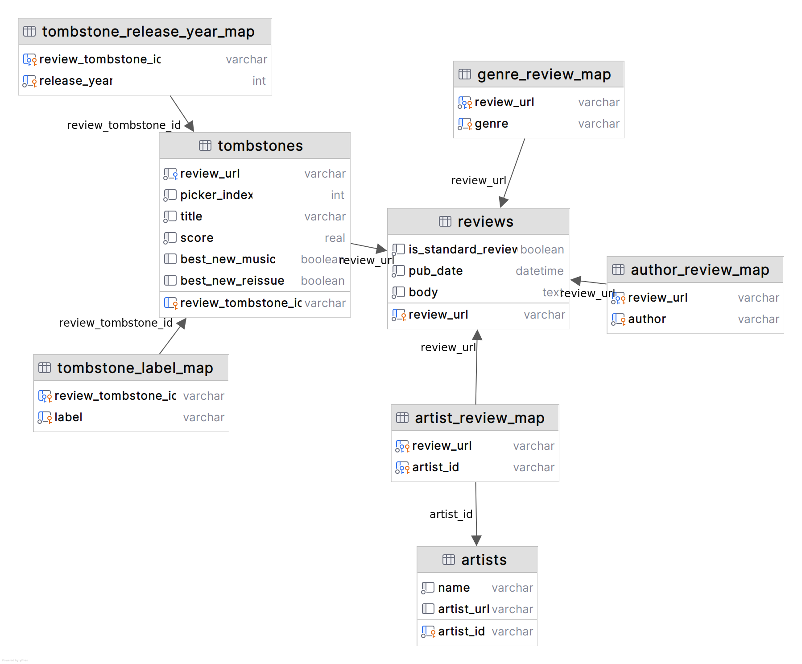

# Pitchfork 2022

[](https://github.com/nolanbconaway/pitchfork-2022/actions/workflows/push.yaml)

In 2017, as I was just stepping into the data science space, [I wrote a web scraper](https://nolanbconaway.github.io/blog/2017/pitchfork-roundup.html) which populated a SQLite database of Pitchfork reviews. That dataset became [quite popular on Kaggle](https://www.kaggle.com/nolanbconaway/pitchfork-data); as of now there are 1750 notebooks exploring the data.

More than five years have passed and I have gotten _a lot_ better at data modeling. I thought it might be fun to rewrite the scraper to see what I did differently, with the hopes of writing a blog post on the mistakes I naively made long ago.

This repo contains the scraper code as it stands; maybe one day I will add in the data. I call it `pitchfork-2022` because I will definitely not finish in 2021.


## TODO

- [x] more pydantic assertions
- [x] make flat view with casted year, etc, types for regular reviews
- [x] better database assertions (at least confirm views are selectable)
- [x] make bnm null for releases prior to bnm
- [ ] spot checks on review content
- [x] detect best new reissues; maybe some way of catching reissues that are not best new?

## Known Issues

### Identifying Reissues

As far as I can tell, there is no _"is reissue"_ tag hidden in the review HTML. Reissues can be identified in obvious cases:

- When there are multiple release years reported.
- When the review is tagged as "Best New Reissue".
- When the publication date is years after the reported release date.'
- When the review is published on a Sunday and opens with the usual preamble (_Each Sunday, Pitchfork takes an in-depth..._).
 
But I have found cases in which Pitchfork only reports the reissue year and which are not Best New Reissue ([example](https://pitchfork.com/reviews/albums/violent-femmes-why-do-birds-sing-deluxe-edition/)). In these cases I have found little to use which would support identification of a reissue.

# Data Model



# Data Build

All of the below relies on the specific structure of Pitchfork's webpages; I do not expect the HTML parsing to work as-is indefinitely, but the data models are sufficiently general so long as new kinds of reviews are not added.

## 1. Get a list of reviews on the website

- Script: `python -m scraper.get_pages`
- Writes: `_data/pages/*.json` 

This is done via a selenium scraper that iterates from page to page, storing the review URLs per page. It should be done overnight or some such because pitchfork often updates and the reviews per page will change. Luckily, once the page-to-url mapping is obtained, you are no longer in a race against time to capture data before things change. 

I ran it once overnight and it took 3h45m to scrape through 2015 pages.

The data should be produced in a form like

```json
{
    "page_scrape_ts_utc": "2021-12-12T01:45:01.438838",
    "page": 113,
    "urls": [
        "/reviews/albums/bellows-undercurrent/",
        "..."
    ]
}
```

## 2. Download the HTML for each of the URLs in the scraped page data

- Script: `python -m scraper.get_reviews_from_pages`
- Writes: `_data/reviews/*.json.gz` 

In this phase the JSON files per page are read and the URL key is iterated upon so that the HTML data for each review is saved. It would be better to obtain this info via XHR or some such structured data, but I was unable to find anything like that so we are in the business of scraping more HTML.

This step will be at least 10x slower than the previous step; one GET request needs to be executed per _review_, and there are 10 reviews per page. Luckily, review URLs shouldn't change and so there is no race against time to scrape the reviews before new ones are added. I recently ran it on ~24k reviews over the course of 1d21h without hitting any unrecoverable http errors.

A selenium browser is used to navigate to each URL and save whatever is under the `site-content` tag. Data are saved in gzipped json files like:

```json
{
    "url": "/reviews/albums/bellows-undercurrent/",
    "review_scrape_ts_utc": "2021-12-12T21:35:01.503821",
    "html": "..."
}
```

## 3. Build a SQLite database using the saved reviews

- Script: `python -m scraper.make_sqlite --procs=max`
- Writes: `_data/data.sqlite3` 

This is the final step, which prepares the analytics-ready sqlite database. Each review's HTML is parsed via Beautifulsoup to extract out relevant info, and the SQLite tables are populated off of Pydantic models.

As is, `python -m scraper.make_sqlite` will run all of the below steps, but the DBT steps can be excluded via `--no-dbt`.

### 3a. Create data models

- DBT shorthand: `dbt run --profiles-dir=dbt --project-dir=dbt`

The target data file is first deleted, then DBT is used to create a new file and run `create table` statements (using a [custom materialization](dbt/macros/create.sql)). Unlike in the usual DBT process, no data are present at this time so the data models are empty. See the Data Model section for info on the schema.

### 3b. Insert data

In this step, HTML is parsed and passed to [Pydantic models](scraper/models.py) that validate the data prior to running `insert` statements on the empty tables.

I have it set up to run in chunks of <= 1000 URLs, depending on how many there are. The data are processed like:

```
for chunk in chunks
    reviews = parse HTML concurrently in N processes
    for review in reviews
        insert data into sqlite
```

I split into chunks because not _all_ computers are blessed with the memory that mine is.

This is _much_ faster than doing everything serially. I ran into database locking issues when doing everything concurrently; so this is probably the fastest option. In the current state it ran in ~10s with `--procs=max` (32 processes on my machine) on 24k reviews.

### 3c. Test the data

- DBT shorthand: `dbt test --profiles-dir=dbt --project-dir=dbt`

The data are tested a fair amount when loaded into Pydantic models, as well as upon insert into the SQLite data; but this final step ensures all tables are selectable and that the schema is internally consistent.
